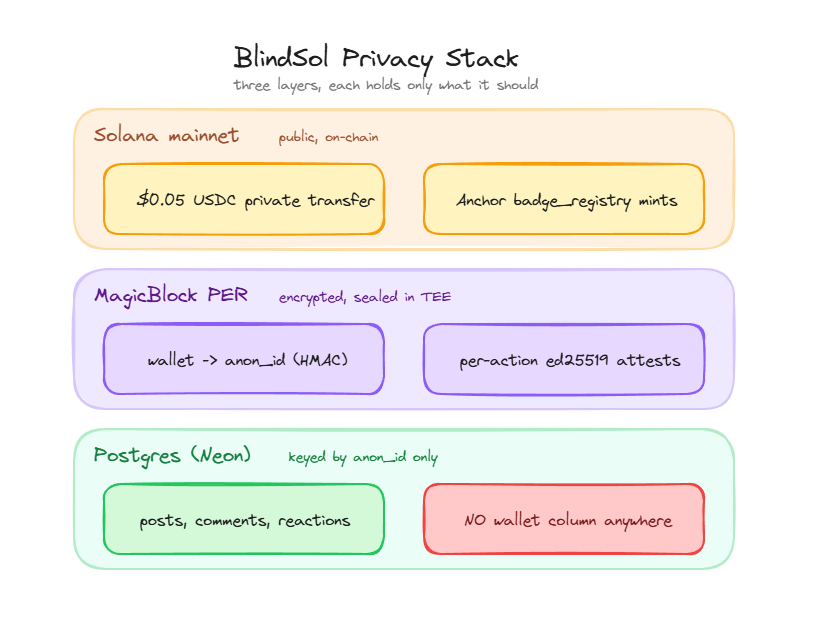
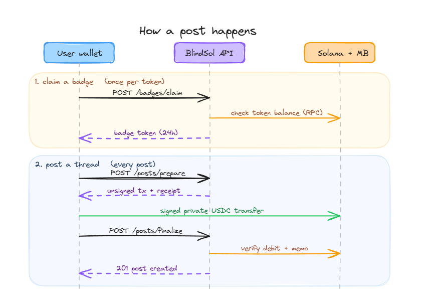

<p align="center">
  
</p>

<h1 align="center">BlindSol</h1>

<p align="center">
  A small forum where verified token holders post anonymously. The wallet ↔ identity link is sealed inside MagicBlock's Private Ephemeral Rollup and never leaves the TEE.
</p>

Submission for **Colosseum Frontier Hackathon · Privacy Track (MagicBlock)**.

## Why this exists

Crypto Twitter is loud and unverified. Real holders self-censor because a wallet on the timeline becomes a wallet on a target list — front-runners, exes, regulators. Self-claimed shilling fills the gap.

BlindSol flips the trade-off: prove you hold (so your voice is verified) but stay anonymous (so your wallet stays your business). Hold $JUP → claim a `$JUP holder` badge → post under a stable anon handle that nobody can map back to your wallet.

## How privacy works

Three layers, each holds only what it should:

<p align="center">
  
</p>

- The Postgres schema has **no wallet column** anywhere on posts/comments/reactions.
- The wallet → anon_id derivation runs inside the rollup as `anonId = HMAC(perSecret, wallet || badgeKind)`. Stable per-wallet/badge, unlinkable without the TEE secret.
- USDC fees move through MagicBlock Private Payments — the chain sees a debit, not which post it paid for.
- Each post/comment/vote ships with an ed25519 attestation signed by the PER key. Even after deletion, the attestation chain proves the action came from a verified holder.

A long-form explainer with diagrams and the honest limitations lives at [`/about`](apps/web/src/app/about/page.tsx) in the running app.

## How a post happens

<p align="center">
  
</p>

The user wallet pays the fee. The server holds nothing that can dox anyone — it only inspects on-chain receipts.

In code:

1. `POST /badges/claim` — wallet signs a server-generated challenge; the TEE verifies the on-chain holdings via Helius RPC and issues a 24h ed25519 badge token.
2. `POST /posts/prepare` — server builds an unsigned MagicBlock private USDC transfer ($0.05 from user → stake pool, `base→base`, `visibility:"private"`) and returns `{ unsignedTx, receipt (server-signed), postId }`.
3. User signs the tx in Phantom and broadcasts it. The transfer settles into the PER vault, attributed to the stake pool.
4. `POST /posts/finalize` — server verifies the tx landed, confirms `senderDebit(tx, mint, fromWallet) >= expected`, matches the memo against `postId`, then INSERTs the row with `title`, `content`, `contentHash`, `perAttestation`, and `stakeTxSignature`.

## Project layout

```
apps/
  api/         Express + Drizzle. Read endpoints, prepare/finalize post pipeline,
               badge issuance, attestation signing, audit log.
  agent/       Claude-driven moderation worker (spam flags, thread summaries).
  web/         Next.js 15 App Router. Wallet adapter, scribbly UI, badge purse,
               composer, threaded comments, /about explainer page.
packages/
  magicblock-client/   TS client for MagicBlock Private Payments + auth helpers.
programs/
  badge-registry/      Anchor program. On-chain registry of badge mints.
                       Deployed to devnet today (Gm6YCG…XU); promote when ready.
assets/
  brand/               Source brand assets (logo PNG). build-icons.py derives
                       /apps/web/public/blindSOL.png and the favicon variants.
```

## Stack

- **Frontend** — Next.js 15, Tailwind, `@solana/wallet-adapter-react`, Patrick Hand + Caveat fonts (the cream-paper / scribble theme).
- **Backend** — Express, Drizzle ORM, Neon Postgres.
- **Privacy** — MagicBlock Private Ephemeral Rollup + Private Payments API.
- **On-chain** — Solana mainnet (USDC fee settlement), Anchor `badge_registry` (devnet today).
- **RPC** — Helius (mainnet) + public devnet.

## Running locally

```bash
pnpm install
cp .env.example .env       # fill in the values listed below
pnpm --filter @blindsol/api db:migrate
pnpm dev                   # API on :3001, web on :3000
```

### Required env vars

| Var | What it's for |
|---|---|
| `DATABASE_URL` | Neon Postgres connection string. Free DB at neon.tech. |
| `SOLANA_RPC_URL` | Mainnet RPC (Helius free tier works). Public mainnet-beta is rate-limited and blocks browser origins. |
| `NEXT_PUBLIC_SOLANA_RPC_URL` | Same URL, exposed to the browser bundle. |
| `BADGE_RPC_URL` | Devnet RPC for the Anchor badge program. |
| `PER_DEV_SECRET` / `PER_ATTESTATION_PUBKEY` | Ed25519 keypair the API uses to sign badge tokens and per-action attestations. Generate with `pnpm --filter @blindsol/api exec tsx scripts/gen-per-key.ts`. |
| `STAKE_POOL_PUBKEY` | Receive-only pubkey where post fees settle. **Receive-only — never store its secret in env.** Rotate to a multisig before real volume. |
| `STAKE_PER_POST_RAW` | Fee in raw USDC units. `50000` = $0.05. |
| `BADGE_PROGRAM_ID` / `BADGE_AUTHORITY_KEYPAIR` | Anchor program ID + authority keypair path. Authority signs `mint_badge` calls; it only needs devnet SOL for tx fees. |
| `ANTHROPIC_API_KEY` | Optional. For the moderation agent. |

`.env.example` ships with comments and the canonical USDC mint (`EPjFWdd5…`).

### Tests

```bash
pnpm --filter @blindsol/api test     # 59 tests: unit + integration against a real Postgres.
```

> Integration tests truncate tables. Use a separate `DATABASE_URL` than your dev/prod data.

### Useful scripts

```
apps/api/scripts/
  gen-per-key.ts          generate a fresh PER ed25519 keypair
  init-registry.ts        initialise the on-chain badge_registry program
  verify-schema.ts        introspect prod DB and print column/index/constraint state
  purge-test-fixtures.ts  delete leftover test rows (anon_a/anon_b/h1/att1/...)
  sweep-orphan.ts         sweep all assets out of an orphaned wallet
apps/web/scripts/
  build-icons.py          regenerate favicon + apple-icon + public logo from
                          assets/brand/blindSOL.png (auto-crops, exports 512/180)
```

## Architecture notes worth knowing

**Posts are forum-shaped.** The composer collects `title` + `body` separately. Both are stored in dedicated columns; the receipt's `contentHash` is over the canonical `${title}\n${body}` so the receipt still binds the full text. Title is nullable for backwards-compat with rows posted before the dedicated column was added.

**Reactions are polymorphic.** A single `reactions` table covers both post-level and comment-level votes via nullable `post_id` / `comment_id` columns. A CHECK constraint enforces exactly one is set. Two partial unique indexes prevent double-voting per subject.

**Multi-badge purse.** A wallet can hold any number of independent badges. Each badge has its own `anonSeed` so $JUP-you and $BONK-you are distinct, unlinkable handles even though they're the same wallet. The active badge is a UI choice; the API just sees whichever bearer token you send.

**Verify by sender debit, not recipient credit.** Private MagicBlock transfers settle into the PER vault, not the recipient's base-layer ATA. So `verifyOnChain` checks `senderDebit(tx, mint, fromWallet) >= expected` — looks at how much USDC left the user's ATA, not how much arrived at the pool's.

**Dual RPC.** The API holds two `Connection` objects: `mainnetConnection` for MagicBlock + USDC, `badgeConnection` for the Anchor program on devnet. Don't unify them or the badge program calls will hit the wrong cluster.

**Wallet ↔ identity stays sealed in the rollup.** Even an operator with full server access only ever asks the PER for attestations — the wallet→anon mapping is encrypted state inside the TEE.

## Honest limitations

- **Holdings are checked at claim time, not at every post.** Once you have a 24h badge token you keep posting under it even if you sell. The fix is a live re-check on `/posts/prepare`; not implemented yet.
- **Threshold is `> 0`, not a USD floor.** Anyone airdropping you 1 lamport of $JUP makes you eligible for a $JUP badge. Adding price-oracle gating with Pyth is queued but not done.
- **Anonymity stops at the network layer.** IP fingerprinting, stylometry, and timing correlation are on the user / Tor / VPN.
- **`programs/badge-registry` is on devnet.** Promoting to mainnet is queued.

## License

MIT.
